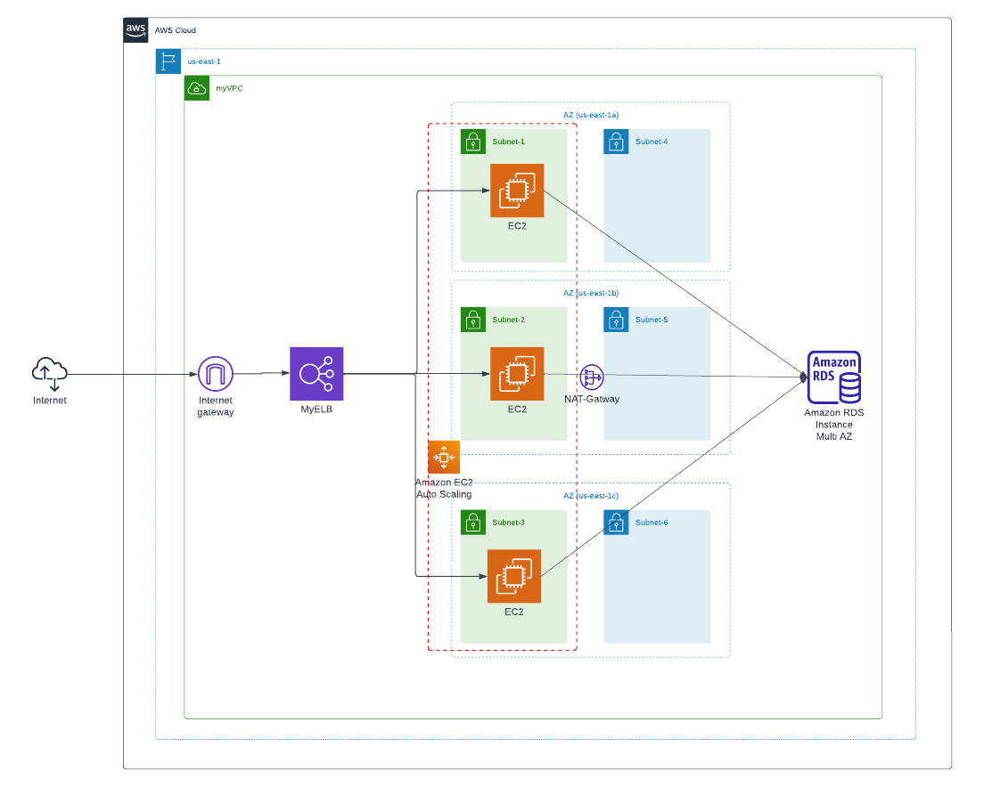

# Scalable and Secure Web Application Architecture with Terraform
## In this project, I used terraform to provisioned AWS infrastructures for a Scalable and Secure Web Application. The infrastructures include:
- Network (VPC, internet-gatway, NAT-gatway, route-table and Subnets)
- EC2 intances in autoscaling Group
- Load Balancer
- RDS

### The Image below shows the architecture diagram.  

  

#### We would have 1 public subnet and 1 private subnet in each availability zone
#### Subnet1, Subnet2 & Subnet3 are public subnets while Subnet4, Subnet5 & Subnet6 are private.
#### Autoscaling group is set up to launch EC2 instances that would host the webapp to the public subnets while the private subnets are designated to the RDS
#### The instance would accept http(s) traffic from the loadbalancer only
#### The loadbalance is set up to allow http(s) from the internet.

## Prerequisites
- vscode
- Terraform installed
- AWS Cli installed
- AWS access key configured in the vscode

## Create the following files in the root dir
- variables.tf
- s3_remote_backend.tf
- provider.tf
- network.tf
- loadbalancer.tf
- autoscaling.tf
- rds.tf
- output.tf
- backend.tf

## Prepare the scripts

1. Create variables. Copy the following scripts into the _variables.tf_ file to specify all variables  

```

variable "region" {
  type    = string
  default = "us-east-1"
}

variable "ami" {
  type    = string
  default = "ami-053b0d53c279acc90"
}

variable "instance_type" {
  type    = string
  default = "t2.micro"

}

# Specify 3 availability zones
variable "availability_zone" {
  type = list(string)
  default = ["us-east-1a", "us-east-1b", "us-east-1c"]
}

# Specify 6 CIDR blocks that would be assigned to subnets within our VPC CIDR block ("10.0.0.0/16")
variable "cidr_blocks" {
  type    = list(string)
  default = ["10.0.1.0/24", "10.0.2.0/24", "10.0.3.0/24", "10.0.4.0/24", "10.0.5.0/24", "10.0.6.0/24"]
}

# Specify the password for the RDS
variable "db_password" {
  description = "RDS root user password"
  type        = string
  default     = "password"
  sensitive   = true
}

# Specify the pem key for the EC2
variable "key_name" {
  type    = string
  default = "rid"
}

```  

2. Create resouces for remote backend
- Copy the following scripts into s3_remote_backend.tf to create bucket  

```  
# Create S3 bucket
resource "aws_s3_bucket" "tf-backend" {
  bucket        = "ridtf-backend"
  force_destroy = true

  tags = {
    Name        = "ridtf-backend"
    Environment = "Dev"
  }
}

# Enable bucket versioning
resource "aws_s3_bucket_versioning" "versioning_tf-bucket" {
  bucket = aws_s3_bucket.tf-backend.id
  versioning_configuration {
    status = "Enabled"
  }
}

# Block Public Access to bucket 
resource "aws_s3_bucket_public_access_block" "bucket-public-block" {
  bucket = aws_s3_bucket.tf-backend.id

  block_public_acls       = true
  block_public_policy     = true
  ignore_public_acls      = true
  restrict_public_buckets = true
}

```  
- Copy the following scripts into s3_remote_backend.tf to create dynamodb table  

```  

# Create dynamodb table to lock remote backend file
resource "aws_dynamodb_table" "tf-lock-table" {
  name         = "ridtf-lock-table"
  billing_mode = "PAY_PER_REQUEST"
  hash_key     = "LockID"

  attribute {
    name = "LockID"
    type = "S"
  }
}

```  
3. Create Network infrastructure  
- Copy the following script into provider.tf  

```  
provider "aws" {
  region                   = var.region
  shared_credentials_files = ["~/.aws/credentials"]
  profile                  = "vscode"
}

```  

- Copy this script to network.tf to create VPC  

```
resource "aws_vpc" "my_vpc" {
  cidr_block           = "10.0.0.0/16"
  enable_dns_hostnames = true
  enable_dns_support   = true

  tags = {
    "Name" = "webappVPC"
  }
}

```  

- Copy this script to network.tf to create gateways  

```  

# Create 6 Subnets
resource "aws_subnet" "subnets" {
  for_each = {
    "Subnet1" = {
      cidr_block        = var.cidr_blocks[0]
      availability_zone = var.availability_zone[0]
      tags              = { "Name" = "Subnet1" }
    }
    "Subnet2" = {
      cidr_block        = var.cidr_blocks[1]
      availability_zone = var.availability_zone[1]
      tags              = { "Name" = "Subnet2" }
    }
    "Subnet3" = {
      cidr_block        = var.cidr_blocks[2]
      availability_zone = var.availability_zone[2]
      tags              = { "Name" = "Subnet3" }
    }
    "Subnet4" = {
      cidr_block        = var.cidr_blocks[3]
      availability_zone = var.availability_zone[0]
      tags              = { "Name" = "Subnet4" }
    }
    "Subnet5" = {
      cidr_block        = var.cidr_blocks[4]
      availability_zone = var.availability_zone[1]
      tags              = { "Name" = "Subnet4" }
    }
    "Subnet6" = {
      cidr_block        = var.cidr_blocks[5]
      availability_zone = var.availability_zone[2]
      tags              = { "Name" = "Subnet6" }
    }
  }
  vpc_id                  = aws_vpc.my_vpc.id
  cidr_block              = each.value.cidr_block
  availability_zone       = each.value.availability_zone
  map_public_ip_on_launch = true
  tags                    = each.value.tags

}

```  
The scripts above will create 6 subnets, 2 subnets in each AZ.

- Copy this script to network.tf to create gateways  

```  

# Create internet gateway
resource "aws_internet_gateway" "my_gw" {
  vpc_id = aws_vpc.my_vpc.id

  tags = {
    "Name" = "Mygw"
  }
}

# Create NAT gateway
resource "aws_nat_gateway" "privNat" {
  connectivity_type = "private"
  subnet_id         = aws_subnet.subnets["Subnet1"].id
}

```

- Copy this script to network.tf to create route table  

```  

# Create route to the internet
resource "aws_route_table" "my_rtb" {
  vpc_id = aws_vpc.my_vpc.id

  route {
    cidr_block = "0.0.0.0/0"
    gateway_id = aws_internet_gateway.my_gw.id
  }

  tags = {
    "Name" = "myRtb"
  }
}

# Create private route
resource "aws_route_table" "priv_rtb" {
  vpc_id = aws_vpc.my_vpc.id

  route {
    cidr_block = "0.0.0.0/0"
    gateway_id = aws_nat_gateway.privNat.id

  }

  tags = {
    "Name" = "private_route"
  }
}

```  

- Copy this script to network.tf to associate Subnet1, Subnet2 & Subnet3 to the public route table.  

```

# Make Subnet1, Subnet2 & Subnet3, public subnets
resource "aws_route_table_association" "myRtb" {
  for_each = {
    "a" = { subnet_id = aws_subnet.subnets["Subnet1"].id }
    "b" = { subnet_id = aws_subnet.subnets["Subnet2"].id }
    "c" = { subnet_id = aws_subnet.subnets["Subnet3"].id }
  }
  subnet_id      = each.value.subnet_id
  route_table_id = aws_route_table.my_rtb.id
}

```

- Copy this script to network.tf to associate Subnet4, Subnet5 & Subnet6 to the private route table.  

```

# Make Subnet4, Subnet5 & Subnet6, private subnets
resource "aws_route_table_association" "privRtb" {
  for_each = {
    "a" = { subnet_id = aws_subnet.subnets["Subnet4"].id }
    "b" = { subnet_id = aws_subnet.subnets["Subnet5"].id }
    "c" = { subnet_id = aws_subnet.subnets["Subnet6"].id }
  }
  subnet_id      = each.value.subnet_id
  route_table_id = aws_route_table.priv_rtb.id
}

```  

- Copy this script to network.tf to create a security group for ec2 instances  

```  

# Create security to allow access within the VPC and from the loadbalancer
resource "aws_security_group" "ec2web_access" {
  name        = "allow_ec2web_traffic"
  description = "Allow Web inbound traffic"
  vpc_id      = aws_vpc.my_vpc.id

  ingress {
    description     = "HTTPS"
    from_port       = 443
    to_port         = 443
    protocol        = "tcp"
    cidr_blocks     = [aws_vpc.my_vpc.cidr_block]
    security_groups = [aws_security_group.elbweb_access.id]
  }
  ingress {
    description     = "HTTP"
    from_port       = 80
    to_port         = 80
    protocol        = "tcp"
    cidr_blocks     = [aws_vpc.my_vpc.cidr_block]
    security_groups = [aws_security_group.elbweb_access.id]
  }
  ingress {
    description = "SSH"
    from_port   = 22
    to_port     = 22
    protocol    = "tcp"
    cidr_blocks = ["0.0.0.0/0"]
  }

  egress {
    from_port   = 0
    to_port     = 0
    protocol    = "-1"
    cidr_blocks = ["0.0.0.0/0"]
  }

  tags = {
    "Name" = "ec2web_access"
  }
}

```  

- Copy this script to network.tf to create a security group for the loadbalncer  

```

# Create security to allow access from the internet to the loadbalncer
resource "aws_security_group" "elbweb_access" {
  name        = "allow_elbweb_traffic"
  description = "Allow Web inbound traffic"
  vpc_id      = aws_vpc.my_vpc.id

  ingress {
    description = "HTTPS"
    from_port   = 443
    to_port     = 443
    protocol    = "tcp"
    cidr_blocks = ["0.0.0.0/0"]
  }
  ingress {
    description = "HTTP"
    from_port   = 80
    to_port     = 80
    protocol    = "tcp"
    cidr_blocks = ["0.0.0.0/0"]
  }

  egress {
    from_port   = 80
    to_port     = 80
    protocol    = "tcp"
    cidr_blocks = ["0.0.0.0/0"]
  }

  tags = {
    "Name" = "elbweb_access"
  }
}

```  

- Copy this script into network.tf to create security for the RDS and allow access from within the VPC to the RDS  

```

# Create security group for the RDS
resource "aws_security_group" "db_sg" {
  name        = "Database SG"
  description = "Allow inbound traffic from application layer"
  vpc_id      = aws_vpc.my_vpc.id

  ingress {
    description = "Allow traffic from application layer"
    from_port   = 3306
    to_port     = 3306
    protocol    = "tcp"
    cidr_blocks = [aws_vpc.my_vpc.cidr_block]
  }

  egress {
    from_port   = 32768
    to_port     = 65535
    protocol    = "tcp"
    cidr_blocks = ["0.0.0.0/0"]
  }

  tags = {
    Name = "Database SG"
  }
}

```

4. Create Load Balancer
- Copy the following scripts into loadbalancer.tf to create a loadbalancer and it's associated resources.

```

# Create loadbalancer with Subnet1, Subnet2 & Subnet3 attched
resource "aws_lb" "my_elb" {
  name               = "my-elb"
  internal           = false
  load_balancer_type = "application"
  security_groups    = [aws_security_group.elbweb_access.id]
  subnets = [
    aws_subnet.subnets["Subnet1"].id,
    aws_subnet.subnets["Subnet2"].id,
    aws_subnet.subnets["Subnet3"].id
  ]

  tags = {
    "Name" = "MyElb"
  }
}

# Create loadbalancer target group
resource "aws_lb_target_group" "my_tgtgrp" {
  name        = "my-tgtgrp"
  port        = 80
  protocol    = "HTTP"
  target_type = "instance"
  vpc_id      = aws_vpc.my_vpc.id

  health_check {
    healthy_threshold   = 2
    unhealthy_threshold = 2
    interval            = 30
    timeout             = 5
    path                = "/"
    port                = "traffic-port"
    protocol            = "HTTP"
  }
}

# Configure loadbalancer to listen on port 80
resource "aws_lb_listener" "my_elb" {
  load_balancer_arn = aws_lb.my_elb.arn
  port              = "80"
  protocol          = "HTTP"

  default_action {
    type             = "forward"
    target_group_arn = aws_lb_target_group.my_tgtgrp.arn
  }
}

```

5. Create Launch template and autoscaling group  
- Copy the follweing scripts into autoscaling.tf to install apache on our EC2 intances  

```  

data "template_file" "user_data" {
  template = <<EOF
#!/bin/bash
sudo apt update -y
sudo apt install apache2 -y
sudo systemctl start apache2
sudo bash -c 'echo You are accessing my server $(hostname -f) > /var/www/html/index.html'
sudo systemctl restart apache2
EOF
}

```  

- Copy the following scripts into autoscaling.tf to create launch template  

``` 

# Create a launch template in our VPC
resource "aws_launch_template" "webapptemplate" {
  name                   = "weblaunch3"
  image_id               = var.ami
  instance_type          = var.instance_type
  key_name               = var.key_name
  user_data              = base64encode(data.template_file.user_data.rendered)
  vpc_security_group_ids = [aws_security_group.ec2web_access.id]

}

```  

- Copy the following scripts into autoscaling.tf to create autoscaling group  

``` 

# Create autoscaling group specifying subnets to launch resouces in
resource "aws_autoscaling_group" "webApptier" {
  name             = "webApptier-autoscaling-group"
  max_size         = 3
  min_size         = 1
  desired_capacity = 2
  vpc_zone_identifier = [

    aws_subnet.subnets["Subnet1"].id,
    aws_subnet.subnets["Subnet2"].id,
    aws_subnet.subnets["Subnet3"].id
  ]

  launch_template {
    id      = aws_launch_template.webapptemplate.id
    version = "$Latest"
  }

  target_group_arns = [aws_lb_target_group.my_tgtgrp.arn]
}

```  

6. Create RDS Database  
- Copy this script into rds.tf to designate a collection of subnets that our RDS instance can be provisioned in.

```

# Designate subnets for RDS
resource "aws_db_subnet_group" "subgrp" {
  name = "subgrp"
  subnet_ids = [
    aws_subnet.subnets["Subnet4"].id,
    aws_subnet.subnets["Subnet5"].id,
    aws_subnet.subnets["Subnet6"].id
  ]

  tags = {
    Name = "My DB subnet group"
  }
}

```  

- Copy this script into rds.tf to create database

```

# Create DB instance
resource "aws_db_instance" "default" {
  allocated_storage      = 10
  db_subnet_group_name   = aws_db_subnet_group.subgrp.id
  engine                 = "Mysql"
  engine_version         = "8.0.32"
  instance_class         = "db.t2.micro"
  multi_az               = true
  username               = "admin"
  password               = var.db_password
  skip_final_snapshot    = true
  vpc_security_group_ids = [aws_security_group.db_sg.id]
  publicly_accessible    = false

}

```  

- Copy this script into output.tf to get the dns name of our loadbalancer  

```

output "alb-dns" {
  value = aws_lb.my_elb.dns_name
}

```

## Provision the resources
- Change directory the root dir
- do _terraform init_
- do _terraform fmt_
- do _terraform validate_
- do _terraform plan_
- do _terraform apply_

### Now that we have the bucket and dynamodb table required for remote_backend provisioned let save the tfstate file to the S3  
- Copy this script into backend.tf to configure remote backend  

```

# Configure remote backend  
terraform {
  backend "s3" {
    bucket         = "ridtf-backend"
    key            = "Dev/terraform.tfstate"
    region         = "us-east-1"
    dynamodb_table = "ridtf-lock-table"
    encrypt        = true
  }
}

```

#### Configure remote backend
- do _terraform init -reconfigure_ and enter yes to proceed
- do _terraform plan_
- do _terraform apply_


#### Destroy the resources
- do _terraform destroy_
